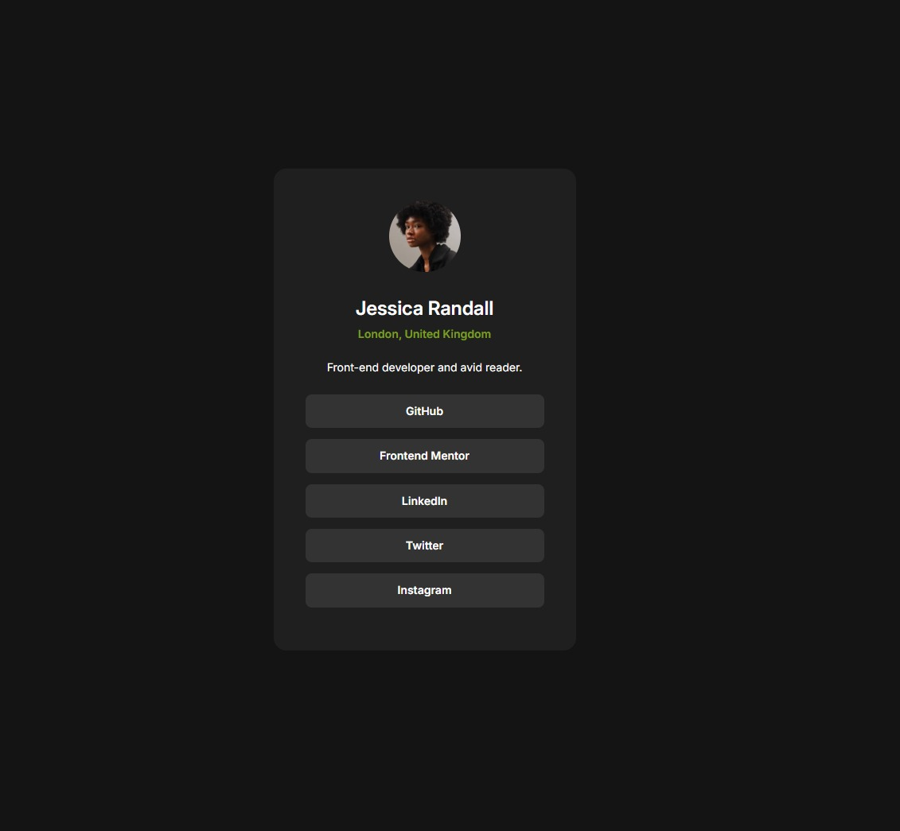

# Frontend Mentor - Social links profile solution

This is a solution to the [Social links profile challenge on Frontend Mentor](https://www.frontendmentor.io/challenges/social-links-profile-UG32l9m6dQ). Frontend Mentor challenges help you improve your coding skills by building realistic projects. 

## Table of contents

  - [Screenshot](#screenshot)
  - [Links](#links)
  - [Built with](#built-with)

### Screenshot

### Links

- Solution URL: [https://www.frontendmentor.io/solutions/css-bem-5NkW7eifIS](https://your-solution-url.com)
- Live Site URL: [https://fernandofoletto.github.io/SocialLinkProfile/](https://your-live-site-url.com)

### Built with

- Semantic HTML5 markup
- CSS custom properties
- Flexbox

